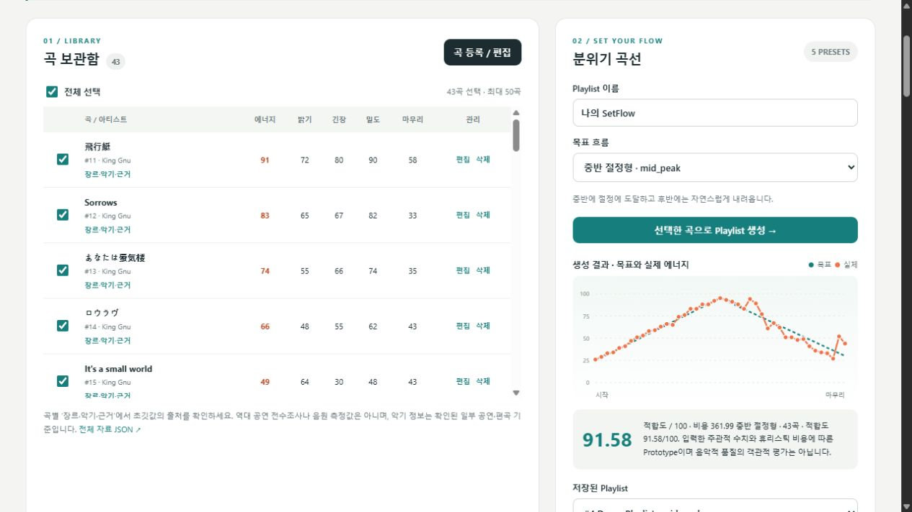

# SetFlow Agent

곡의 분위기 고저차를 고려해 플레이리스트를 만드는 Python 에이전트 서버입니다. King Gnu 43곡의 조사 초깃값을 불러오고, 원하는 흐름을 선택하면 곡 순서와 배치 이유를 확인할 수 있습니다.

**[수행평가 4] AI 에이전트 서버 프로젝트**  
제출 예정일: **2026년 9월 16일** · 자료 정리일: 2026년 9월 15일

GitHub 저장소: [san232/setflow-agent](https://github.com/san232/setflow-agent)

## 웹사이트로 배포하기

[Render에서 무료 웹 서버 만들기](https://render.com/deploy?repo=https://github.com/san232/setflow-agent)

저장소의 `render.yaml`이 Python 서버 설치·실행, 상태 확인, 시작 시 King Gnu 43곡 불러오기를 설정합니다. Render 계정으로 위 링크를 열고 **Free** 서비스를 배포하면 접속용 HTTPS 주소가 생깁니다. 배포 화면·설정값·검증 순서는 [배포 안내](docs/DEPLOYMENT.md)에 있습니다.

공개 체험판은 API 키 없이 Demo Mode로 동작합니다. 보관함·결과·요청 로그는 방문자끼리 공유하며, 무료 서버가 다시 켜질 때 초기화될 수 있으므로 결과를 JSON/M3U로 저장하세요. 개인적으로 계속 저장해 사용할 때는 아래의 로컬 실행을 사용합니다.

## 설치하고 실행하기

Python 3.12 이상을 설치한 Windows PC에서 ZIP을 풀고 `setflow-agent` 폴더를 PowerShell로 엽니다. 다음은 Python 3.12 Launcher 기준입니다.

```powershell
py -3.12 -m venv .venv
.\.venv\Scripts\python.exe -m pip install -r requirements-lock.txt
$env:PYTHONUTF8 = "1"
$env:SETFLOW_DEMO_MODE = "true"
.\.venv\Scripts\python.exe -m uvicorn app.main:app --host 127.0.0.1 --port 8765
```

Python Launcher가 없다면 첫 줄의 `py -3.12`를 설치한 Python 실행 파일 경로로 바꿉니다. 가상환경 활성화 없이 실행 파일을 직접 호출하므로 PowerShell 실행 정책을 변경할 필요가 없습니다.

브라우저에서 [SetFlow 열기](http://127.0.0.1:8765/)를 엽니다. 상단에 **서버 정상 · Demo Mode**가 표시됩니다. 종료는 실행 중인 터미널에서 `Ctrl+C`입니다.

## 곡 불러오기부터 도구 확인까지

1. **King Gnu 43곡 불러오기**를 누릅니다. 새로운 DB에는 43곡이 추가되고, 다시 눌러도 기존 곡의 편집값을 덮어쓰지 않습니다.
2. 보관함에서 사용할 곡을 선택합니다. 곡의 **장르·악기·근거**를 펼치면 출처와 초깃값을 볼 수 있습니다.
3. **목표 흐름**에서 중반 절정형 등을 고른 뒤 **선택한 곡으로 Playlist 생성**을 누릅니다.
4. 목표·실제 에너지 곡선, 적합도, 곡별 역할과 배치 설명을 확인합니다.
5. **자연어로 요청하기**에 아래 문장을 직접 입력하고 **요청 보내기**를 누릅니다. 예시 버튼은 입력란을 채워 줍니다.
6. 답변 아래의 **선택된 Tool / Arguments**와 오른쪽 **최근 실행 로그**를 확인합니다. Form의 직접 REST 작업과 Agent의 도구 실행은 구분됩니다.

```text
현재 등록된 곡을 보여줘.
중반 절정형으로 플레이리스트를 만들어줘.
왜 이 순서로 배치했는지 설명해줘.
방금 만든 플리를 JSON으로 내보내줘.
```

Demo Mode는 문장 패턴과 대화 문맥으로 도구를 선택합니다. 곡 ID를 생략한 자연어 생성은 보관함 전체를 사용합니다. 여러 아티스트를 추가한 뒤 일부만 생성하려면 Form에서 선택하거나 `곡 ID: 1, 2, 3`처럼 실제 ID를 지정합니다.

CLI로 같은 초깃값을 불러올 수도 있습니다. 서버를 종료한 뒤 실행하고 다시 켭니다.

```powershell
.\.venv\Scripts\python.exe -X utf8 -m scripts.seed
```

## 주요 기능

| 기능 | 동작 |
|---|---|
| 곡 보관함 | 제목·아티스트와 다섯 분위기 값 등록·조회·수정·삭제 |
| King Gnu 카탈로그 | 43곡의 초깃값, 장르·악기 자료, 대표 공연 배치 근거 |
| 다섯 흐름 | 완만한 상승, 중반 절정, 후반 폭발, 잔잔한 여운, 자동 흐름 |
| 순서 생성 | 목표 곡선과 곡 사이 변화 비용을 줄이는 Python 정렬 |
| 결과 확인 | 에너지 곡선, 적합도, 역할, 배치 이유, 비용 내역 |
| 도구 실행 | 등록된 8개 도구의 인자 검증과 성공·실패 기록 |
| 저장·파일 출력 | SQLite에 곡·결과·로그 저장, JSON/M3U 다운로드 |

수치 `energy`, `valence`, `tension`, `density`, `closure`는 각각 에너지, 밝기, 긴장도, 밀도, 마무리 적합도이며 **0~100 정수의 주관적 평가값**입니다. King Gnu 값은 2019~2025년 대표 공연 7개와 음악 자료를 참고했습니다. 곡별 악기 정보는 해당 자료에 기록된 공연·편곡을 기준으로 읽습니다. 범위·출처·보정 공식은 [조사 문서](docs/KING_GNU_DATA.md)에 있습니다.

JSON에는 순서와 점수·설명이 담깁니다. M3U는 곡의 `media_uri`를 재생 항목으로 기록하며, 재생 위치가 없는 곡은 `#MISSING_MEDIA` 주석으로 표시합니다. 곡 정보 편집 후 새 결과를 생성하면 수정값이 반영됩니다. 기존 결과는 생성 당시의 값을 보존합니다.

## 요청이 실행되는 구조

```text
사용자 문장 → AgentService → DemoRouter
                            ↓ 도구 이름과 인자
                        ToolExecutor
                            ↓
       ToolRegistry의 이름 확인·Pydantic 검증
                            ↓
            Handler → Application → Domain / SQLite
                            ↓
             실행 결과·도구 로그 → 웹 화면
```

등록된 도구는 `add_song`, `list_songs`, `update_song`, `delete_song`, `generate_playlist`, `get_playlist`, `explain_playlist`, `export_playlist`입니다. 순서 자체는 서버의 정렬 알고리즘이 계산합니다.

| 코드 위치 | 역할 |
|---|---|
| `app/main.py`, `app/api/` | 서버 시작, REST 요청·응답 |
| `app/agent/` | 도구 선택, 대화 상태, 실행 및 로그 |
| `app/tools/` | 도구 등록, 인자 스키마, 실제 함수 연결 |
| `app/application/` | 곡·플레이리스트 사용 사례와 저장 계약 |
| `app/domain/` | 곡선, 비용, 순서 최적화, 설명 |
| `app/infrastructure/` | SQLite 영속 저장 |
| `app/static/` | 보관함, 생성 결과, Agent와 로그 화면 |
| `data/king_gnu_*.json` | 조사 원자료, 음악 기본값, 보정값, 초기 곡 |
| `tests/` | 정렬·API·도구·카탈로그 테스트 |

[API 문서](http://127.0.0.1:8765/docs)는 서버 실행 중 확인할 수 있습니다.

## 검증과 실행 자료

2026-09-15 프로젝트 가상환경에서 **62 passed, 1 deselected, 1 warning in 23.83s**를 기록했습니다. 기본 테스트 설정이 `live_openai` 1개를 제외하며, 기본 실행에는 로컬 정렬·API·DB·도구 테스트와 외부 응답을 대체한 루프 테스트가 포함됩니다.

```powershell
.\.venv\Scripts\python.exe -X utf8 -m pytest -q
```

현재 43곡의 중반 절정형 브라우저 실행 결과는 **적합도 91.58**, 표시 비용 **361.99**입니다. 적합도는 설정된 비용 함수에 대한 값입니다.



- [검증 기록과 실행 로그](docs/VALIDATION.md)
- [개발일지와 문제 해결](docs/DEVELOPMENT_LOG.md)
- [도구 등록·선택·실행 코드 설명](docs/CODE_EXPLANATION.md)
- [실사용 후기 초안](docs/USER_REVIEW.md)
- [블로그 게시용 초안](docs/BLOG_DRAFT.md)
- [캡처 안내](docs/SCREENSHOT_GUIDE.md)
- [제출 전 확인표](docs/SUBMISSION_CHECKLIST.md)

## 제출용 ZIP 만들기

Git이 설치된 환경에서 프로젝트 폴더를 기준으로 실행합니다. Git 저장소가 없는 새 복사본이라면 `git init`을 먼저 실행합니다.

```powershell
.\.venv\Scripts\python.exe -m scripts.package_submission
```

상위 폴더에 `SetFlow-Agent-submission.zip`이 만들어집니다. 코드, README, 개발 문서, 데이터와 캡처를 포함하며 가상환경·실행 DB·`.env`·임시 결과물은 제외합니다. ZIP을 새로 푼 환경에서는 위 순서로 의존성 설치와 43곡 불러오기를 진행합니다.
