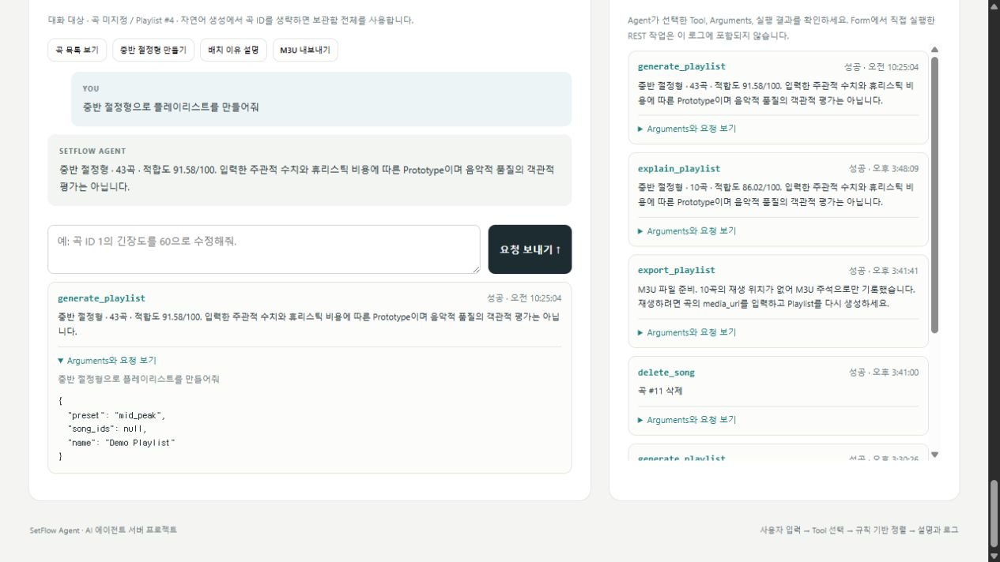

# 플레이리스트의 고저차를 정리하는 SetFlow 만들기

[수행평가 4] AI 에이전트 서버 프로젝트

## 순서를 고민하던 일에서 시작했다

플레이리스트를 만들 때 나는 분위기의 고저차가 어떻게 배분되는지를 중요하게 생각한다. 처음부터 끝까지 강한 곡만 이어지는 순서와, 중간에 분위기가 올라갔다가 여운을 남기는 순서는 느낌이 다르다. 그런데 플레이리스트를 만들 때마다 직접 이 흐름을 고민하는 일은 번거로웠다. 수행평가에서는 이 과정을 도와줄 도구인 SetFlow를 만들었다.

## King Gnu 43곡으로 흐름을 만들기

앱에서 King Gnu 43곡을 불러온 뒤 원하는 곡과 흐름을 선택하면 플레이리스트가 생성된다. 완만한 상승, 중반 절정형, 후반 폭발형, 잔잔한 여운, 곡 분포에 맞춘 자동 흐름을 고를 수 있다. 결과에서는 목표 에너지와 실제 곡의 에너지를 곡선으로 비교하고, 각 곡이 그 자리에 놓인 이유도 읽을 수 있다.

곡마다 에너지·밝기·긴장도·밀도·마무리 적합도를 0~100으로 기록했다. King Gnu의 2019~2025년 대표 공연 7개와 음악 자료를 참고해 채운 주관적 초깃값이다. 곡별 장르·악기·근거를 펼치면 그 값에 참고한 정보를 볼 수 있고, 내 취향에 맞게 수정할 수도 있다.

여기서 신경 쓴 부분은 ‘공연 끝에 나온 곡’과 ‘에너지가 낮은 곡’을 같은 뜻으로 보지 않는 것이었다. 그래서 에너지와 마무리 적합도를 별도로 다뤘다. 음악적 특징을 바탕으로 잡은 값에 공연 배치를 일부 반영해, 끝곡으로 자주 쓰이는 성격과 곡 자체의 강도를 나눴다.

## 한 문장이 실제 도구로 이어지는 과정

‘중반 절정형으로 플레이리스트를 만들어줘’라고 입력하면 어떤 도구가 실행되는지 확인할 수 있다. 이번 실행 화면은 Demo Mode이며, 문장 패턴으로 `generate_playlist`를 선택하고 `preset=mid_peak`를 전달한다. 곡 ID가 없으면 보관함 전체를 사용한다.

도구는 이름만 정해 놓은 목록이 아니다. Registry에 이름·설명·인자 모델·실제 처리 함수를 연결해 두었다. 실행기는 등록된 이름인지 확인하고 입력값을 검증한 뒤 처리 함수를 호출한다. 실행이 끝나면 요청 문장, 도구 이름, 인자, 성공 여부와 결과를 SQLite에 기록한다. 화면에서 ‘왜 이 도구가 이 인자로 실행되었는지’를 되짚을 수 있도록 만든 것이다.

순서는 Python 알고리즘이 계산한다. 목표 곡선에서 벗어나는 정도와 앞 곡에서 변하는 폭 등을 비용으로 두고, 비용이 작아지는 방향으로 곡을 배치한다. 먼저 한 곡씩 순서를 만들고, 두 곡을 바꿔서 전체 비용이 줄어드는 경우를 찾는다. 생성한 결과와 설명은 함께 저장하며 JSON이나 M3U 파일로 내보낼 수 있다.

## 구현하면서 고친 문제

AI 코딩 도구를 활용해 구현하고, 실행과 테스트를 확인하면서 수정했다. Python 실행 환경이 바로 잡히지 않아 프로젝트 전용 가상환경을 구성했고, 한글 경로가 깨지는 출력에는 UTF-8 설정을 적용했다. JSON 다운로드는 Blob 방식에서 자동화 도구가 이벤트를 확인하지 못해, 동작을 확인한 서버 다운로드 URL을 사용하도록 바꿨다.

기억할 만한 문제는 테스트의 가정이었다. 처음에는 다섯 정렬 방식이면 다섯 개의 서로 다른 순서가 나와야 한다고 생각했다. 하지만 같은 곡 집합에서 두 상승형 곡선이 같은 순서를 만들 수 있었다. 알고리즘이 무조건 다른 순서를 내도록 바꾸는 대신, 목표 곡선의 차이와 여러 정렬 결과를 검사하도록 테스트를 수정했다.

9월 15일 자동 테스트에서는 `62 passed, 1 deselected, 1 warning in 23.83s`를 기록했다. 기본 테스트 설정은 `live_openai` 테스트 1개를 제외한다. 브라우저에서는 43곡 중반 절정형 결과와 적합도 91.58, 생성·조회·설명·JSON 내보내기의 실행 로그를 확인했다. 이 적합도는 설정한 주관적 수치와 비용 함수에 대한 값이다.

## 직접 사용해 본 소감

플레이리스트를 만들 때 분위기의 고저차가 어떻게 배분되는지를 중요하게 생각한다. 이전에는 플레이리스트를 만들 때마다 직접 순서를 고민해야 해서 번거로웠다. SetFlow에서는 원하는 흐름을 선택해 곡을 배치할 수 있어서 이 과정이 편해진 점이 좋았다.

불편했던 점: [본인 확인]

개선하고 싶은 점: [본인 확인]

## 코드와 실행 자료

저장소에는 설치·실행법을 담은 README와 개발일지, 코드 설명, King Gnu 조사 근거, 실행 캡처 및 테스트 로그를 함께 정리했다. 코드를 내려받은 뒤 43곡 불러오기부터 도구 실행 로그 확인까지 따라갈 수 있도록 구성했다.

GitHub 저장소: [san232/setflow-agent](https://github.com/san232/setflow-agent)

이 글의 게시 URL: [게시 후 입력]

---

게시 전 편집 메모: 위 본인 확인란과 실제 URL을 채운 뒤 이 메모를 삭제한다. 이미지는 `docs/screenshots/submission/`의 같은 파일명으로 첨부한다. 자료의 상세 출처는 [King Gnu 조사 문서](KING_GNU_DATA.md)에 있다.
